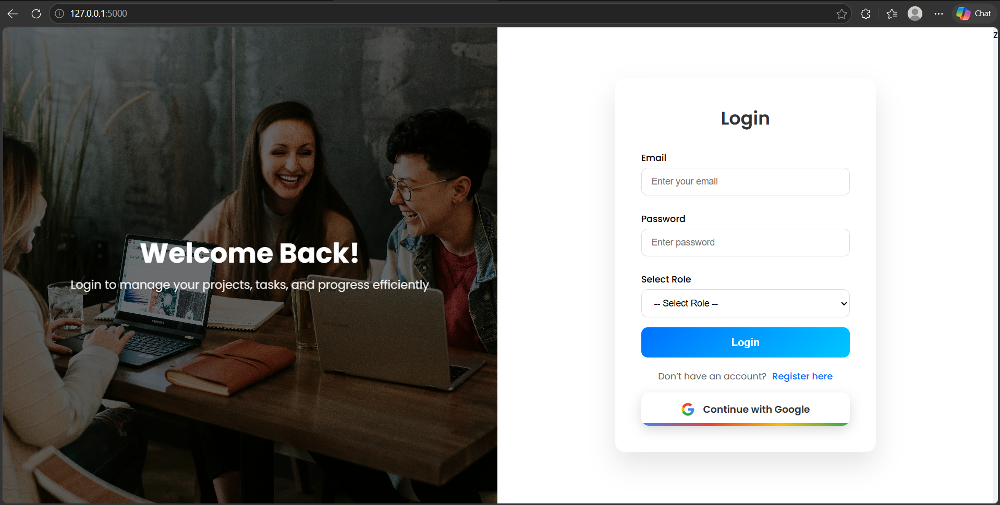
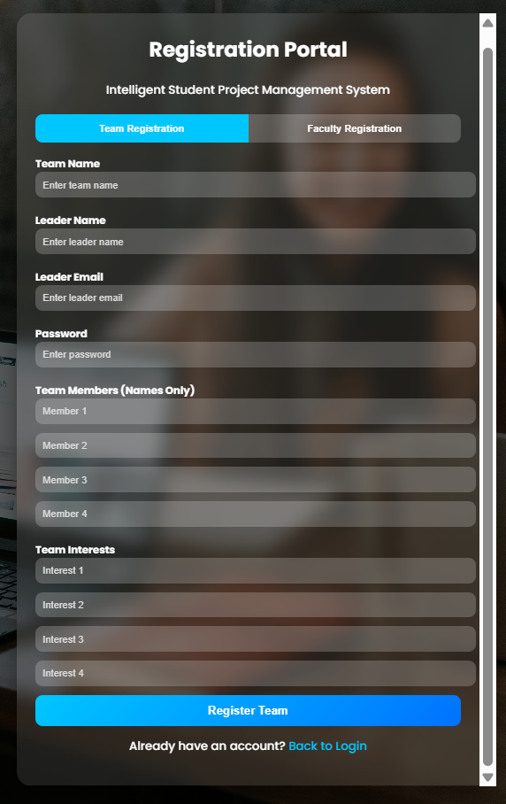
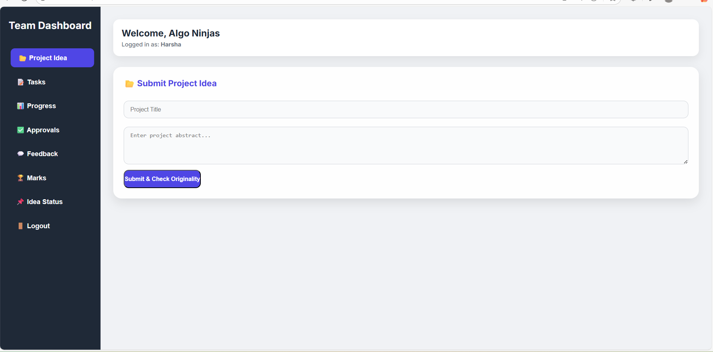
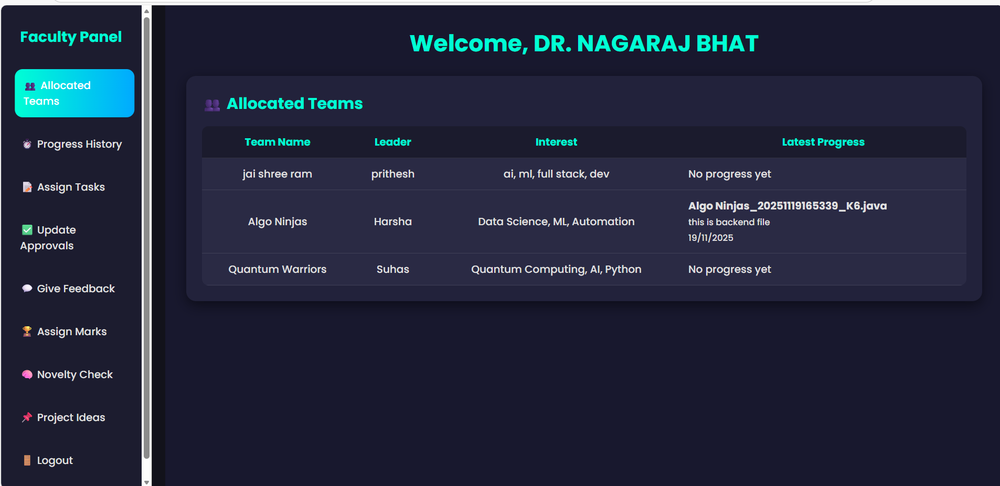
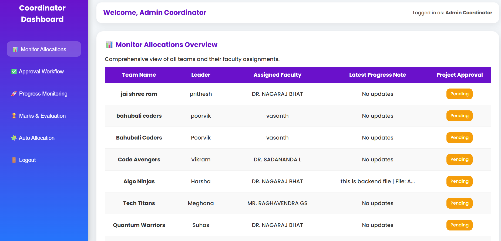

# 🚀 Student Project Management System

The **Student Project Management System** is an AI-powered web-based platform designed to simplify and improve the management of academic student projects. It helps students 👨‍🎓, faculty members 👨‍🏫, and project coordinators 👨‍💼 efficiently manage project workflows, task tracking, evaluations, and approvals through dedicated dashboards.

It is also an important part of the curriculum in many institutions because students get to apply their learning to actual problems 💡. However, most existing project management processes are ambiguous, slow, and difficult to track. As a result, repeated mistakes, poor coordination, and disorganized workflows occur, creating the need for a more reliable and intelligent system ⚡.

To address these problems, the proposed solution introduces an AI-powered web application with the following major functionalities:

- 🧠 **Novelty Detection** using NLP and machine learning concepts to verify the originality of project ideas.
- 🤝 **Intelligent Supervisor Allocation** to fairly distribute student teams among suitable faculty supervisors.
- 📈 **Progress Tracking and Evaluation** for managing tasks, submissions, approvals, feedback, and student performance in a transparent way.

The system aims to make student project management more transparent, organized, equitable, and user-friendly for both students and supervisors 🌟. The platform can further be extended with advanced analytics, dashboards, and leaderboard systems.

---

# ✨ Features

## 👨‍🎓 Team Dashboard
- 📌 Submit project ideas
- 📋 View assigned tasks
- 📤 Upload project progress
- ✅ Track approvals and marks
- 💬 View faculty feedback
- 💭 Chat interface with faculty

---

## 👨‍🏫 Faculty Dashboard
- 👀 Monitor allocated teams
- 📝 Assign tasks and deadlines
- 💬 Provide feedback
- ✔️ Approve or reject project stages
- 🏆 Assign evaluation marks
- 🔍 Review submitted project ideas

---

## 👨‍💼 Coordinator Dashboard
- 📊 Monitor project workflow
- 🔗 View team allocations
- 📈 Track project progress
- 📉 View analytics
- ✅ Manage approvals

---

# 💻 Frontend Tech Stack

- 🌐 HTML5
- 🎨 CSS3
- ⚡ JavaScript
- 📊 Chart.js
- 🔌 Socket.IO (Frontend Integration)

---

# 📁 Project Structure

```txt
frontend/
│
├── index.html
├── login.html
├── team-dashboard.html
├── faculty-dashboard.html
└── project_coordinator-dashboard.html
```

---

# 📸 Screenshots

## 🔐 Login Page


---

## 📝 Registration Page


---

## 👨‍🎓 Team Dashboard


---

## 👨‍🏫 Faculty Dashboard


---

## 👨‍💼 Coordinator Dashboard


---

# 👨‍💻 Author

**Prashanth Kulal**
